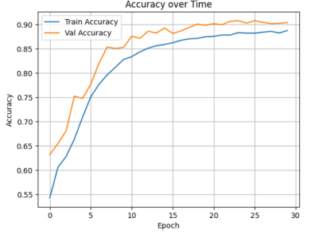
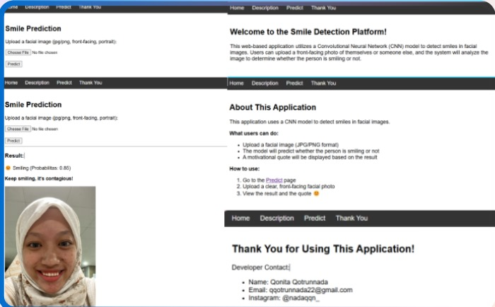

# 😄 Smile Detection using CNN
A deep learning project to detect smiles in facial images using a **Convolutional Neural Network (CNN)** trained on the **CelebA dataset**.  
The model classifies whether a person is smiling or not based on **grayscale facial images**.

## 📌 Project Overview
- **Goal**: Detect the presence of a smile (binary classification: smiling vs not smiling)  
- **Dataset**: CelebA - CelebFaces Attributes Dataset  
- **Model**: Custom CNN with 3 convolutional blocks  
- **Accuracy**: Tracked over 30 training epochs  
- **Testing**: Predicts smile presence on new custom images  

## 📂 Dataset
- **Source**: CelebA Dataset (GitHub mirror)  
- **Focus label**: `Smiling` (1 = smiling, 0 = not smiling)  
- **Images used**: First 50,000 images  

### 🔧 Preprocessing
- Convert to **grayscale**
- Resize to **64x64**
- Normalize pixel values to **[0–1]**
- Labels are extracted from `list_attr_celeba.txt`

## 📊 Training and Validation Accuracy

Here’s the accuracy graph over 30 training epochs:

## 🖼️ Sample Prediction Web View

This is an example of the smile detection result shown on a web page:

## 🎯 Results
- The CNN model successfully detects smiles with high accuracy
- Works even under varied lighting and angles due to data augmentation
- Predictions show confidence scores, making the output interpretable

## 🧠 Future Improvements
- Use the entire CelebA dataset to improve accuracy
- Implement real-time webcam detection
- Apply transfer learning (e.g. MobileNetV2, EfficientNet)
- Improve robustness to lighting, occlusion, and expressions
